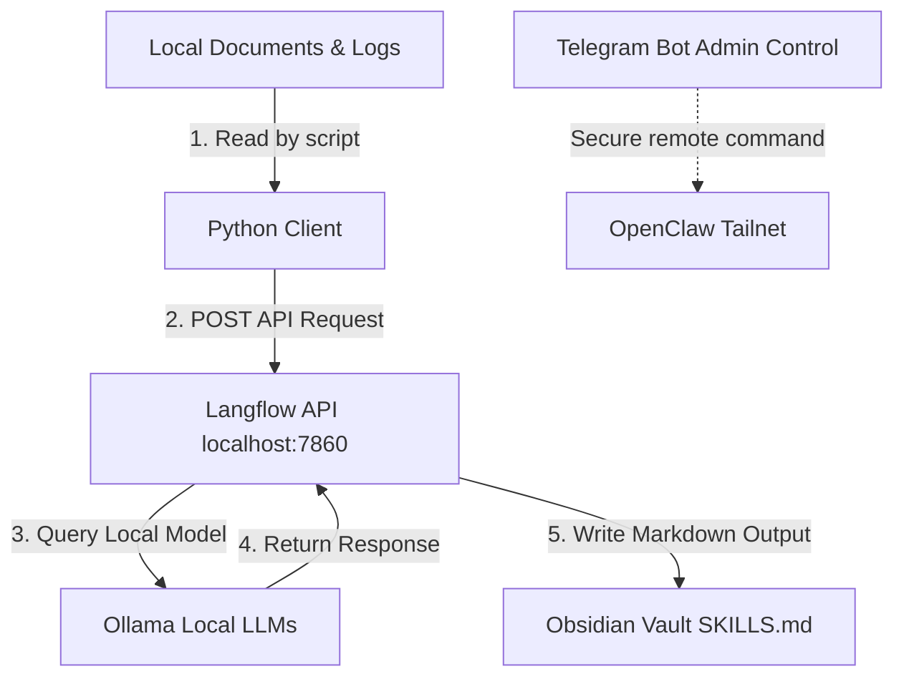

# 🛡️ Cyber Swiss Army Knife

A local-first, highly specialized personal AI infrastructure and pentesting environment that bridges a Windows host with a WSL (Ubuntu) backend. This system is designed around a "markdown-first" philosophy for processing penetration testing logs, categorizing MITRE ATT&CK tactics, and orchestrating workflows using local LLMs.

---

## 🚀 System Architecture



### 1. Core philosophy
The system is inspired by the **markdown-first** philosophy, using structured markdown files as the primary knowledge base. This ensures maximum portability, long-term readability, and easy searchability with standard command-line tools.

### 2. Infrastructure Stack
* **Host Environment**: Windows with PyCharm IDE.
* **Backend Environment**: Ubuntu on WSL for Linux-native security and network tools.
* **Local LLMs**: [Ollama](https://ollama.com/) running local, offline models (such as `qwen3.5:0.8b`) to ensure privacy and data ownership.
* **Orchestration**: [Langflow](https://www.langflow.org/) exposing a local orchestration pipeline API at `http://localhost:7860`.
* **IDE Integration**: MCP (Multi-Capability Peripheral) servers bridge PyCharm with the WSL filesystem and tools.
* **Secure Remote Access**: [OpenClaw](https://github.com/openclaw) configured on a Tailscale network (Tailnet), with a Telegram Bot for remote administrative control and notifications.

---

## 📁 Repository Structure

* `trigger_langflow.py` - Standard library-only portable Python script to stream text/docs to the Langflow API.
* `ARCHITECTURE.md` - Core system architecture specifications.
* `MEMORY.md` - Operational log of recent configuration changes and wins.
* `Langflow/` - Custom Langflow pipeline exports and definitions.
* `Documents/` / `Source-Documents/` - Markdown files, log inputs, and reference docs.
* `Skills/` - Structured capability files and pentesting checklists output by the system.
* `Snippets/` - Useful helper scripts and configurations.

---

## 🛠️ Getting Started

### Prerequisites
1. **Python 3.10+** (using only standard libraries for the integration script).
2. **Ollama** installed locally and running.
3. **Langflow** running on port `7860`.

### Running the Integration Script
To send document text to your local Langflow pipeline:
```powershell
python trigger_langflow.py --flow-id <YOUR_FLOW_ID> --path <PATH_TO_DOCUMENT>
```
